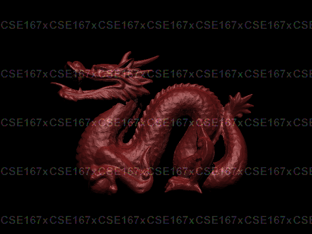

# Welcome to Ned Bitar's User Page

I am a *Computer Engineering* major at **UCSD** and I really enjoy it. I get to see how things are put together from an electrical, hardware, and software level. It is really amazing. 
> My favorite quote of all time is: *"Start Early and Start Often".*

My first ever line of code I ever wrote is this:
```python
# Hello World program in Python
print("Hello, World!")
```

The hardest class I have taken from last quarter is CSE 167. You can find more about my experience in CSE 167 in the [CSE 167 Section](#my-favorite-course-cse-167).

## Classes I am taking this Quarter:

1. **CSE 110**
2. **CSE 141**
3. **CSE 141L**
4. **ECE 140B**
5. **ECE 171A**

#### Tasks for Next Week:
- [x] Finish CSE 110 Lab 1
- [ ] Start preparing for Interviews
- [ ] Attend career fair

##### You Should Also Visit my [README.MD](README.MD)

## My favorite Course: CSE 167!

My all time favorite class at UCSD has to be **CSE 167**. It definitely happened to be the hardest. I had to relearn a lot of linear algebra, and eventually I was tasked with coding up my own raytracer from scratch. It was incredibly fun. If you are more interested you can check out the course website: [CSE 167 Winter 2024](https://cseweb.ucsd.edu//~viscomp/classes/cse167/wi24/index.html)


### Here is an image my raytracer generated:


*Watermark is necessary to avoid any academic integrity violations.*

#### Things I enjoyed in CSE 167:
- Learning linear algebra
- Coding a raytracer from scratch


